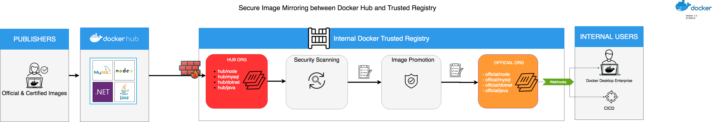
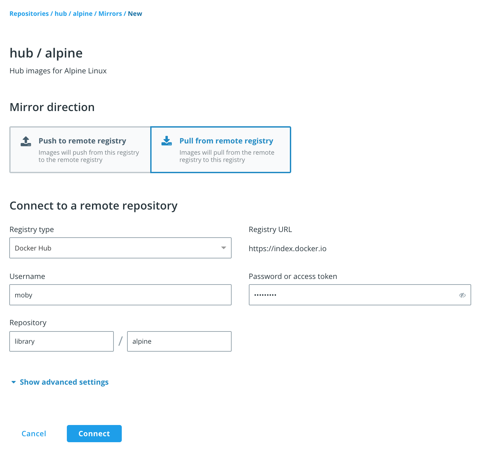
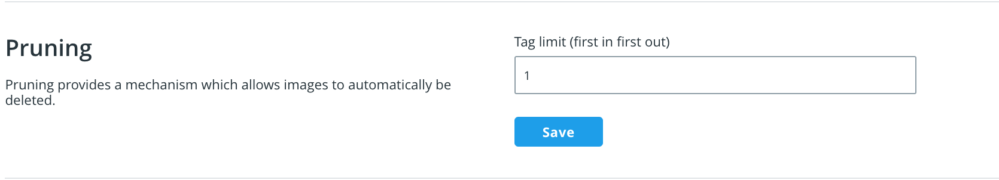
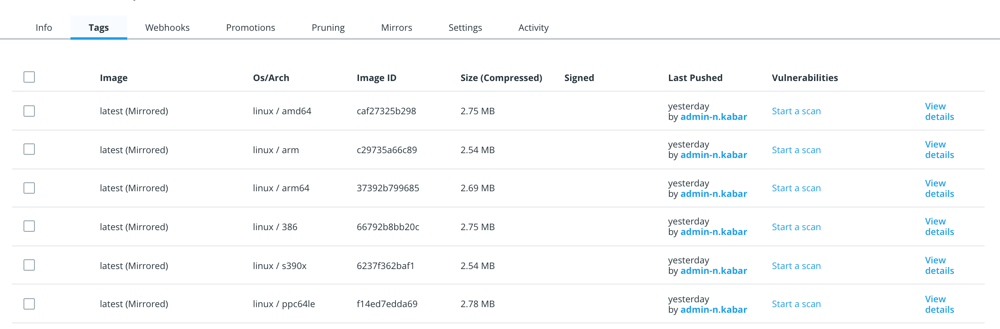
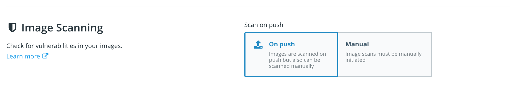
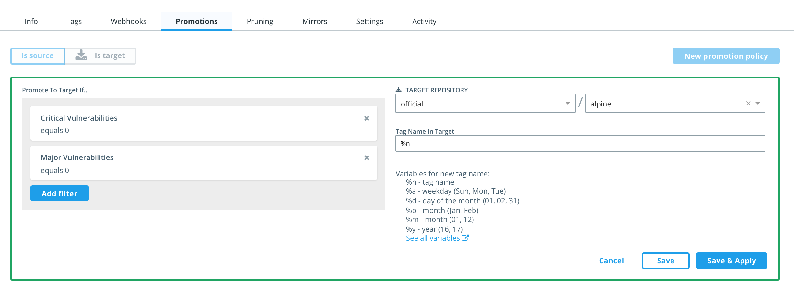

#  Streamlined Docker Image Mirroring from Docker Hub to an Internal Docker Registry

## Overview

Enterprises are facing a challenge of balancing the speed at which they introduce up-to-date base and middleware images for their internal developers and the increase in security risk associated with every new image introduced. Many developers within enterprises are requesting access to more and more container images from various public container image registries (like [Docker Hub](https://hub.docker.com/welcome)). Typically in most enterprise environments, access to Docker Hub is blocked for security purposes. Yet, there is a continued pressure on the operations teams to provide base and other middleware images to their internal developer teams. In this blog, I will walk you through a solution to help address this challenge by streamlining the process of importing Docker Hub images into the Enterprise environments using Docker Trusted Registry (the registry component within Docker Enterprise)
## Prerequisites

- Docker Enterprise 2.1+
- Docker Trusted Registry 2.6.2+ with Internet(Proxy Ok) Access
- Docker Hub ID / Account

## Solution Approach

Docker Trusted Registry (DTR) is the registry component of Docker Enterprise. You can deploy it on-premise within your data-center or on a private or public cloud. It is not a SaaS product. Enterprises use DTR to securely store and distribute all their container images. It is based on of the open-source Docker registry but adds Enterprise functionalities such as high-availability, image vulnerability scanning, image signing, image caching, and role-based access control to name a few. There are, however a couple of features within DTR that would address the challenge I described earlier,namely: Image Mirroring, Scanning, and Promotion.

At a high level, we will be using Image Mirroring to automatically pull images from Hub as soon as they are published. Once they are pulled to DTR, we will use Image Scanning to ensure that the image meets your internal security policies. Image pruning is then used to limit the number of images stored. Finally, we will use Image Promotion to promote secure images (ONLY!) to an internally-accessible repository and provide the right set of notifications and access for developers or CI systems to use. 

I recommend having two organizations(namespaces) within DTR: **hub** and **official**. The hub organization will serve as the insecure, private, and staging organization for images coming from Docker Hub. All repositories in this organizations should not be accessed by developers. The official organizations will serve as the internally accessible and secure organization for images that can be consumed internally by developers. Make sure you create these organizations and use the naming convention that works best for you!

## Image Mirroring and Pruning

The first step in our approach is to utilize these two key features to automate the process in which images are imported from the public Docker Hub into DTR itself. First, image mirroring can be configured in **Pull** mode to perform a per-repository check on any new image that got published to a specific Docker Hub repository (upstream). If a new image is published to the Docker Hub repository, DTR will pull this image automatically. DTR is configured to check Docker Hub every 15 minutes for newer images. DTR also support multi-architecture images so it will pull all available image architectures (ARM,x86..etc). DTR can be [configured with your existing enterprise proxy](https://docs.docker.com/ee/dtr/admin/configure/use-a-web-proxy/) to access Docker Hub. This way you can limit Docker Hub access to only DTR as opposed to individual developers or users within the organization.

The mirroring configuration follows a one-to-one mapping to an upstream repository. Therefore you have to set-up mirroring for every repository you wish to mirror from an upstream Docker Hub repository. This can be done by both the DTR console and the DTR API. Note that you still need to supply a Docker ID and Password to access Hub even if you're trying to pull a public image. In the below example we are creating a private repository called `hub/alpine` that will mirror from the official `library/alpine` Alpine repository in Docker Hub.

An additional functionality of DTR is Image Pruning which allows you to automatically limit the number of images(tags) within each repository. This is a per repository setting to avoid growing the back-end storage with hundreds of images that could be either old or insecure. As an admin, you can configure the pruning setting under the repository's settings page. Recommendation is to limit repository to < 10 tags. Leaving it at 0 means it will allow unlimited tags! Again, this can also be done via API. Head over to https://YOUR_DTR_URL/docs/api and you can view all available API functionalities and test them out directly from there.

If you give it 15 minutes or so, you should start seeing images being populated in your `hub/alpine` repository.

## Image Security Scanning

Now that the images are automatically mirrored from Docker Hub, we can start the image scanning process. You first need to [enable Security Scanning](https://docs.docker.com/ee/dtr/admin/configure/set-up-vulnerability-scans/) as a global feature. Only admins can do that. Once you do that, you have the option to enable scanning at the repository level. You can do that by either allowing scanning on push of every new tag or manually triggering scanning each image. 

The advantage of scanning on push is that it's triggered automatically with every image pulled from Docker Hub without having to manually trigger the process. The downside, however, is if you have hundreds of repositories each with tens of images, scanning each image as they get pulled from Hub can cause larger load (CPU) on the DTR VMs which can eventually slow down the scanning process.

## Image Promotion 

We can now use Image Promotion policies to promote images from the `hub` organization to the `official` organization to be consumed by developers. Images hosted under the `official` organization can be set in public mode which would allow unauthenticated DTR users who can access DTR (your internal developers) to pull from them. You can however have the repositories be private but that will introduce some management overhead to manage permissions. Public mode only allows developers who can access the internal DTR to access the images. It does not mean it's publicly available to the internet!

We can use the vulnerability scan results as a criteria to promote the images. Other available criteria include: license, image component, tag name. In this case,we'll make sure that only images with no critical or major vulnerabilities are promoted.

Once you save the configuration, the promotion policy will kick-in and you should only see images that match the criteria you set in the promotion policy.

## Webhooks

You can use the DTR webhooks functionality to send outgoing webhooks to an external service. A good use-case for webhooks is to notify developers when a new tag is available for them. Another use-case is to trigger a CICD job to trigger some automated testing against the image. There are a wide variety of use-cases for webhooks that you can utilize out-of-the-box with DTR. The list of available events that you can trigger a webhooks from is the following:

- Tag Pushed
- Tag Pulled 
- Tag Deleted
- Manifest Pushed
- Manifest Pulled 
- Manifest Deleted
- Security Scan Succeeded
- Security Scan Failed
- Image Promoted
- Image Mirrored 

You can configure webhooks per repository if you go under the Settings page. In the future, I will will write a blog on detailed use-cases for webhook integration with Slack and Jenkins. 

## Summary

In this blog, we went through an end-to-end workflow to securely and automatically import images from Docker Hub and run them through a process to make sure they're secure, scanned, and properly promoted to an internally accessible repositories for developers to consume. 

## Additional Resources

- [Image Mirroring](https://docs.docker.com/ee/dtr/user/promotion-policies/pull-mirror/)
- [Image Promotion](https://docs.docker.com/ee/dtr/user/promotion-policies/internal-promotion/)
- [Image Pruning](https://docs.docker.com/ee/dtr/user/tag-pruning/)
- [Image Security Scanning](https://docs.docker.com/ee/dtr/user/manage-images/scan-images-for-vulnerabilities/)