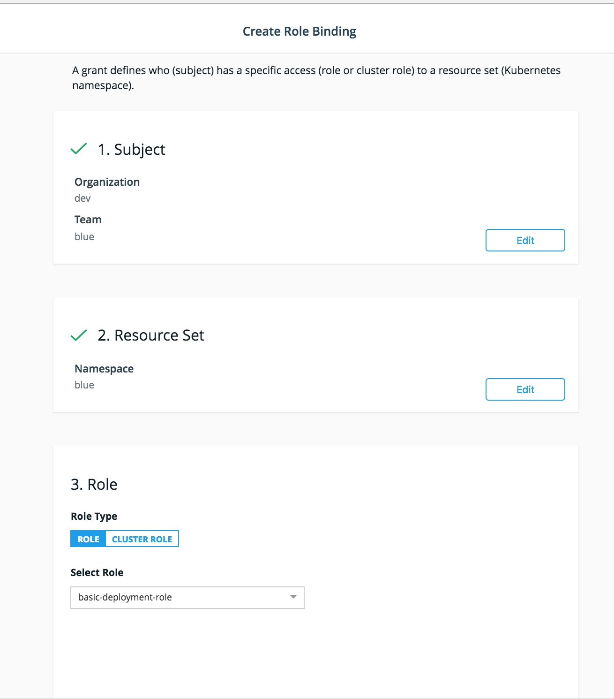

# 7 Practical Steps to Onboard your Teams into Docker Enterprise 3.0

Building a multi-tenant shared container platform is no easy task! In this article I will be going over the 7 key steps to help you build and onboard your teams to a highly-available container platform with Docker Enterprise. 

### Context

The focus of this post is on Docker Enterprise 3.0 runtime control plane, UCP, and specifically the Kubernetes orchestrator within it. UCP 3.0, that went GA back in early 2018, ships with a fully-supported and conformant Kubernetes distribution. Kubernetes provides a long list of capabilities for orchestrating your container-based application deployments at scale. With these capabilities comes the challenge of ensuring that different teams using the platform/orchestrator are utilizing the best out of the platform without interfering with the other teams. Although UCP provides a set of guide-rails, there is still a need for the UCP admins to go through a set of Kubernetes policy definitions and enforcements. I will go in details through the following 7 areas that every UCP admin needs to consider before onboarding their teams into the platform:

  - [1. Organizational Layout](#organizational-layout)
  - [2. Namespaces](#namespaces)
  - [3. Network Security Policies](#network-security-policies)
  - [4. Resource Quotas and Limits](#resource-quotas-and-limits)
  - [5. Role Based Access Control Policies](#role-based-access-control-policies)
  - [6. Pod Security Policies](#pod-security-policies)
  - [7. Access Guidelines](#access-guidelines)

## Organizational Layout

We need to start with some basic definition of users, teams, and organizations in Docker Enterprise. Although the naming convention is ~self-explanatory, let me clarify a couple of points before we dig in. 

First let's start with how we define Organizations, Teams, and Users in Docker Enterprise. It's important to understand how that definition relates to Kubernetes's subjects definition. In Docker Enterprise, Organizations are composed of teams, which are composed of users. Organizations themselves are most significant within Docker Enterprise and do not represent any significance in Kubernetes or for that matter any other external system. Teams, on the other hand, are typically mapped to groups in both Kubernetes and in AD/LDAP or SAML-based authentication services like Okta or ADFS. 

Organizations are a critical component within Docker Enterprise because they are synced between UCP and DTR to tie-in access and authorization policies across the runtime components in UCP and the images in DTR so keep that in-mind when you're mapping out your groups into Docker Enterprise. Use organizations to group multiple teams together that would typically inherit similar corporate policies, work on shared project, co-build or share microservices, report to same leadership or business function, or frequently interact with each other. 

Teams are best mapped to logically-independent groups in authentication services. This should be consistent with your existing policies like any other enterprise product you are using. Typically this is already done for you and all you have to do is get the AD/LDAP/SAML group and use that when you're creating the team in Docker Enterprise. If you need to re-define or shuffle users into new unique groups within Docker Enterprise, I recommend to create new user groups in your auth service and tie that to Docker Enterprise. This will be a better solution compared with trying to manually add/remove users to teams in Docker Enterprise.  Avoid any manual user management at all costs! That also mean never create any user manually!

Finally, the following table shows how Docker Enterprise subjects are mapped to the underlying Kubernetes subjects. This will help you when you define policies down the road. 

|Docker Enterprise   |  Kubernetes 
|---|---|---|---|---|
| Organization  |  Group
| Team | Group
| User | User
| Service Account | Service Account 

Once you map out your organizations and team structure to map what suits your internal teams you are ready to create teams and organizations in Docker Enterprise. Below you'll find useful links to help you through that process. Remember that pretty much you can do/automate all of these steps via [UCP's API](https://docs.docker.com/reference/ucp/3.2/api/)

**Resources:**
- [Enabling LDAP/AD Based Authentication](https://docs.docker.com/ee/ucp/admin/configure/external-auth/)
- [Enabling SAML Based Authentication](https://docs.docker.com/ee/ucp/admin/configure/enable-saml-authentication/)
- [Creating and Syncing UCP Teams to LDAP/AD/SAML Groups](https://docs.docker.com/ee/ucp/authorization/create-teams-with-ldap/#binding-to-the-ldap-server)

Throughout this article, I'd like to walk you throught an onboarding example so you can correlate the recommendations with actionable steps. I will start by creating a sample organization called `dev` in UCP with two teams `blue` and `red` where the user `moby.dock` is part of the `blue` team and the user `molly.dock` is part of the `red` team. Having that logical structure is important before you create any group withing UCP.

```
dev (org)
    \
     blue(team)
        \
         moby.dock(user)
     red(team)
        \
         molly.dock(user)    
```


## Namespaces

Kubernetes's [namespaces](https://kubernetes.io/docs/concepts/overview/working-with-objects/namespaces/) provide a layer of isolation so your development teams can run their applications independently and securely on the same Kubernetes cluster. Typically, you would want to create a namespace for each team or project in your organization and apply policies on that namespace to protect it and other teams from any resource conflicts or security flaws. Creating a namespace needs to be part of your onboarding process as it should only be done by UCP admins.

We would need to create a namespace for each of the teams that we had created previously. The easiest method to create these namespaces is to use [kubectl](https://docs.docker.com/ee/ucp/user-access/kubectl/) CLI tool to interact with Kubernetes. We can use [the following](scripts/create-namespaces.yml) yaml file to create the two namespaces using `kubectl`.

```
🐳  → cat create-namespaces.yml
apiVersion: v1
kind: Namespace
metadata:
  name: blue
---
apiVersion: v1
kind: Namespace
metadata:
  name: red

🐳  → kubectl create -f create-namespaces.yml
namespace "blue" created
namespace "red" created

 🐳  → kubectl get ns
NAME          STATUS    AGE
blue          Active    56s
default       Active    106d
kube-public   Active    106d
kube-system   Active    106d
red           Active    56s
ingress       Active    106d
```

The namespaces were created, there is still no association between the teams and the namespace! We'll go through that in a bit.

Although not required, I recommend using `<ORG>-<TEAM>` as a naming convention for your namespaces. This ensures that no conflicts will occur if you have two similarly-named teams in two different organization. Remember that namespaces' names must be unique across the cluster!


**Resources:**
- [Kubernetes Namespaces](https://kubernetes.io/docs/concepts/overview/working-with-objects/namespaces/)


## Network Security Policies

Now that we created the namespaces, we will gradually touch on the key policies that the UCP admins need to consider applying to these namespaces before any team can get access to their respective namespaces.

Let me provide some contexts before we dig into network security policies. By default, application pods deployed within Kubernetes do not have any network restrictions. **ANY** pod across **ANY** namespace can connect to **ANY** other pod across **ANY** namespace. This is by design as the CNI model in Kubernetes separates pod network **reachability** from pod network **security**. In summary, any deployed pod will get an IP address of its own that can be reached by any other pod on a flat network defined by a `pod-cidr-range` subnet during cluster setup. UCP abstracts all that for you and utilizes the widely used [Calico CNI plugin](https://www.projectcalico.org/) as the default CNI for connecting and securing Kubernetes pods.

Kubernetes offers a slick method to define **network policies** that govern network communication between pods, services, and namespaces. Here are some common use-cases for network policies

- Restrict access to pods on select TCP or UDP ports
- Restrict all inbound network connectivity to the a namespace
- Allow only select services to connect to a service
- Only allow pods within a namespace to talk to each other 

Typically, we recommend applying a network policy to restrict pods to only communicate with other pods within the same namespace only. Effectively limiting all other network communication to the namespace itself. This will ensure that no pod from one team's namespace can connect to a pod to another team's namespace. If you have a requirement to connect two pods across two different namespace, then you can create a policy to explicitly allow that. Although it is not required,  I recommend starting with an explicit "deny all" policy that will effectively deny all traffic from/to any pod. I say it is not needed because the moment you apply any network security policy, you apply an implicit "deny all" policy. Then you start opening up the environment by creating policies to explicitly allow certain network traffic as you see fit. 

Now let's take a look at this [base-network-policy.yaml](scripts/base-network-policy.yml) configuration yaml file:

```
🐳  → cat base-network-policy.yml
# Deny All Network Policy for the Blue Namespace
kind: NetworkPolicy
apiVersion: networking.k8s.io/v1
metadata:
  name: default-deny
  namespace: blue
spec:
  podSelector:
    matchLabels: {}
---
# Deny All Network Policy for the Red Namespace
kind: NetworkPolicy
apiVersion: networking.k8s.io/v1
metadata:
  name: default-deny
  namespace: red
spec:
  podSelector:
    matchLabels: {}
---
# Only accept traffic from all local pods in the Blue namespace
kind: NetworkPolicy
apiVersion: networking.k8s.io/v1
metadata:
  namespace: blue
  name: deny-from-other-namespaces
spec:
  podSelector:
    matchLabels:
  ingress:
  - from:
    - podSelector: {}
---
# Only accept traffic from all local pods in the Red namespace
kind: NetworkPolicy
apiVersion: networking.k8s.io/v1
metadata:
  namespace: red
  name: deny-from-other-namespaces
spec:
  podSelector:
    matchLabels:
  ingress:
  - from:
    - podSelector: {}
```

Once we apply these policies, we ensured that pods can only reach pods within the namespace they are in. No external traffic or traffic from any other namespace can reach pods in either the RED or BLUE namespaces.

```
🐳  → kubectl apply -f network-policy.yaml
networkpolicy.networking.k8s.io "default-deny" created
networkpolicy.networking.k8s.io "default-deny" created
networkpolicy.networking.k8s.io "deny-from-other-namespaces" created
networkpolicy.networking.k8s.io "deny-from-other-namespaces" created

🐳  → kubectl get networkpolicy --all-namespaces
NAMESPACE   NAME                         POD-SELECTOR   AGE
blue        default-deny                 <none>         18s
blue        deny-from-other-namespaces   <none>         18s
red         default-deny                 <none>         18s
red         deny-from-other-namespaces   <none>         17s
```
The following diagram visualizes this policy.


You may ask how can external or internet client connect to applications pods in these namespaces if they're locked down this way? The answer to that leads us to another topic which is around ingress traffic. Ingress traffic is defined as any traffic entering the Kubernetes cluster wether that's from other services in your data center/cloud or from internet clients accessing your application. It is common to see a dedicated namespace for [ingress controllers](https://kubernetes.io/docs/concepts/services-networking/ingress/#ingress-controllers). Ingress traffic terminates in that namespace and the ingress controller pods connect to the internal application pods running across other namespaces in the cluster (see below). If you have an ingress namespace, I recommend defining explicit policy that allow traffic from it to application namespaces across your cluster. The following is an example of how you would achieve that using the (ingress-network-policy.yaml) [scripts/ingress-network-policy.yaml] configuration yaml.

```
kind: NetworkPolicy
apiVersion: networking.k8s.io/v1
metadata:
  namespace: blue
  name: allow-ingress-traffic-to-blue-namespace
spec:
  podSelector:
    matchLabels: {}
  ingress:
  - from:
    - namespaceSelector:
        matchLabels:
          name: ingress
---
kind: NetworkPolicy
apiVersion: networking.k8s.io/v1
metadata:
  namespace: red
  name: allow-ingress-traffic-to-red-namespace
spec:
  podSelector:
    matchLabels: {}
  ingress:
  - from:
    - namespaceSelector:
        matchLabels:
          name: ingress
```

The following diagram visualizes the ingress policy policy.


If you haven't used Ingress Controllers on UCP, I recommend my quick guide I wrote on that topic [here](https://github.com/nicolaka/docker-enterprise/tree/master/ingress).

**Resources:**
- [Kubernetes Network Policies](https://kubernetes.io/docs/concepts/services-networking/network-policies/)
- [Excellent tutorial and inf on Securing Kubernetes Cluster Networking by Ahmet Alp Balkan!](https://ahmet.im/blog/kubernetes-network-policy/)

## Resource Quotas and Limits

The next step in our onboarding journey is to make sure we define resource quotas per namespace. By default, any pod will run with unbounded CPU, memory, storage requests/limits. Resource quotas are a method to ensure that your application pods utilize the CPU, memory, and storage resources that they are allowed to. Again, one of the key benefits of using Kubernetes is that it provides a general-purpose compute cluster for all your applications. That means that different applications will be co-hosted on the same physical or virtual machines. Without limiting what each team can deploy and how much resources their deployments can use, there will be resource contention within your cluster. That's exactly what resource quotas are designed to do.

The three typical types of resources that you can define in a resource quota are CPU, memory and storage. There is also a way for you to limit the object count per namespace. Objects here are Kubernetes objects like deployments, cron jobs, secrets, pods and so on. I don't suggest including object count unless your start seeing some application groups launching an unmanageable number of applications which can impact the overall cluster performance. 

I recommend starting by defining 3 resource quota templates: Small, Medium, and Large (following the T-Shirt size model) based on your cluster resource capacity. Based on the application team's requirements, assign the template that provides sufficient resources to run the intended applications with some extra room for the applications growth. If there is a need to increase the resource limits for a namespace, you can always adjust the resource quota assigned to it or bump their resource quota. Either way, just remember that there is some level of flexibility around resource quotas in Kubernetes.

Here's an example of three [Resource Quota template](scripts/resource-quota-template.yml) defining a **small,medium**, and **large** resource quota with sample CPU, memory, and storage requests quotas. You can assign it the namespace by adding the namespace's name in the yaml config or adding `-n <NAMESPACE>` when you issue the `kubectl apply` command. The official [Kubernetes Resource Quotas](https://kubernetes.io/docs/concepts/policy/resource-quotas) documentation pages does an excellent job of going through various scenarios and available options.  

```
🐳  → cat resource-quota-template.yml
apiVersion: v1
kind: ResourceQuota
metadata:
  name: resource-quota-template-small
spec:
  hard:
      requests.cpu: "8"
      requests.memory: "32Gi"
      requests.storage: "32Gi"
---
apiVersion: v1
kind: ResourceQuota
metadata:
  name: resource-quota-template-medium
spec:
  hard:
      requests.cpu: "16"
      requests.memory: "64Gi"
      requests.storage: "64Gi"
---
apiVersion: v1
kind: ResourceQuota
metadata:
  name: resource-quota-template-large
spec:
  hard:
      requests.cpu: "32"
      requests.memory: "128Gi"
      requests.storage: "128Gi"
```

> **Note:** When you use `requests` or `limits` in the resource quota definition, all pods launched in that namespace are required to specify a `requests` and `limits` resource spec. Alternatively, you can define a `LimitRange` policy to launch all pods with a set `requests` and `limits` resource spec if they are launched without one ( see additional resources below) 

We will use this template to create two quotas for the two namespaces we had. We will assign the `red` namespace a `small` quota and the `blue` namespace a `medium` quota as follows (also available in [resource-quota-red](scripts/resource-quota-red.yml) and [resource-quota-blue](scripts/resource-quota-blue.yml))

```
 🐳  → cat resource-quota-red.yml
apiVersion: v1
kind: ResourceQuota
metadata:
  name: resource-quota-red
  namespace: red
spec:
  hard:
      requests.cpu: "8"
      requests.memory: "32Gi"
      requests.storage: "32Gi"
🐳  → cat resource-quota-blue.yml
apiVersion: v1
kind: ResourceQuota
metadata:
  name: resource-quota-blue
  namespace: blue
spec:
  hard:
      requests.cpu: "16"
      requests.memory: "64Gi"
      requests.storage: "64Gi"

🐳  → kubectl apply -f resource-quota-red.yml
resourcequota "resource-quota-red" created
🐳  → kubectl apply -f resource-quota-blue.yml
resourcequota "resource-quota-blue" created
```

Once the policies are created you can view and manage them through UCP's UI. I still do recommend monitoring resources using your favorite monitoring solution to help you with capacity planning across your cluster(s). 


**Resources:**
- [Kubernetes Resource Quotas](https://kubernetes.io/docs/concepts/policy/resource-quotas)
- [Configure default memory requests and limits for a namespace](https://kubernetes.io/docs/tasks/administer-cluster/manage-resources/memory-default-namespace/)
- [Kubernetes best practices: Resource requests and limits by Sandeep Dinesh](https://cloud.google.com/blog/products/gcp/kubernetes-best-practices-resource-requests-and-limits)

## Role Based Access Control Policies

Now we come to the RBAC definition and management as you onboard new teams onto the Docker Enterprise platform. RBAC can be used to restrict access to resources and operations within the Kubernetes cluster. Before we dig into the details of RBAC, let me go over a quick primer on key RBAC terminologies:

1. **Subject** a user, group (UCP Team or Organization), or service account
2. **Role** a definition of the allowed permissions that the subject(s) has in a given namespace
3. **RoleBinding** a mapping between the subject and their role in a given namespace
4. **ClusterRole** a definition of the allowed cluster-wide permissions that the subject(s) has 
5. **ClusterRoleBinding** a mapping between a subject and a cluster role

The subjects should be pre-created in the first step when you create Teams and Organizations. The only exception to that is `ServiceAccounts`. `ServiceAccounts` are usually used by services(not users) like CI, monitoring, alerting, runtime security, to dynamically access some resources withing the Kubernetes cluster.

Cluster admins are responsible for creating and maintaining RBAC policies. By default, all non-admin users have read-only access to basic information about themselves. They can not create new deployments, view other namespaces' deployments, or change anything in the environment. They are basically view-only users. Admins need to create RBAC policies for users to be able to start deploying or making any changes within their namespace. 

The typical workflow for creating RBAC policies is to start by defining a set of standard **Roles** that are used for all groups as you onboard them. These standard roles ensure that the group is allowed to perform basic application deployments,creating ConfigMaps, create secrets,and request persistent volumes (this is a sample list).  If a group or set of groups require additional permissions like accessing the Kubernetes API or other cluster-wide resources, then you can consider creating specialized `Roles` and `ClusterRoles` for these groups and apply them as needed. `ClusterRoles` and `ClusterRoleBinding` follow the same workflow but pertain to cluster, non-namespaced resources. 

Roles are defined via YAML as a list of rules that a subject has access to. Let's take a look at a basic `Role` that allows the subjects to perform basic functionalities with `Deployments`, `Pods`, `Secrets`, and `ConfigMaps` within the `blue` namespace. We're calling this role `basic-deployment-role` and is [here](scripts/basic-deployment-role.blue.yml)  

```
apiVersion: rbac.authorization.k8s.io/v1beta1
kind: Role
metadata:
  name: basic-deployment-role 
  namespace: blue
rules:
  - apiGroups:
      - ""
    resources:
      - configmaps
      - pods
      - deployments
      - secrets
    verbs:
      - get
      - create
      - update
      - list
```

The `Role` must have one or more `Rules`. Each rule includes the `apiGroup`,`resources`, and `verbs`. The API Group needs to be a valid [Kubernetes API group](https://kubernetes.io/docs/concepts/overview/kubernetes-api/#api-groups). Resources can be any Kubernetes resources defined under the `Kind` key in YAML. `Pods`, `ReplicaSets`, `Deployment`, `ConfigMap`, `Secrets` are all examples of what can be defined under `Resources`. Finally, the verbs are the API verbs that can be performed on the listed resources. The [Kubernetes RBAC documentation](https://kubernetes.io/docs/reference/access-authn-authz/rbac/) provide an excellent primer into defining your RBAC roles. Let's go ahead and see how we can create it using `kubectl`

```
 🐳  → kubectl apply -f basic-deployment-role.blue.yml
role.rbac.authorization.k8s.io "basic-deployment-role" created
🐳  → kubectl get role -n blue
NAME                    AGE
basic-deployment-role   5s
```

The `RoleBinding` is how you associate a Subject to a Role. You can create a `RoleBinding` in two ways in UCP. One via the standard `kubectl apply` with YAML, and the other is via creating a Grant in the UCP UI.  Let's see how we can do it with the UI. Both are valid approaches so you can pick the one you're most comfortable with. 

Navigate to UCP, and click on **Access Control** > **Grants** > **Create Role Binding**. Then you can select the Subject, Resource Set, and Role. In our case, I'm selecting a specific team to be the subject so that all members within that team can inherit this `RoleBinding`. The Resource Set defines which namespace we're applying this RoleBinding to ( you can bind it to all namespaces equivalently making it a `ClusterRoleBinding` but that is not recommended or needed here). Finally you can select the Role you're associating here which is the `basic-deployment-role` that we previously created in the `blue` namespace.



Once you create the Grant which is effectively the UI version of a Kubernetes RoleBinding. You can test if users can indeed start deploying applications in the blue namespace.

As a final check before you provide access to teams, you can use [Kubernetes User Impersonation](https://kubernetes.io/docs/reference/access-authn-authz/authentication/#user-impersonation) as an admin to verify that users are only allowed the operations you allowed them through the various policies you defined. It's a very handy mechanism to check. You can also incorporate it as part of the onboarding process as a final verification step before you open the gates to the platform!

For example, if you want to double check if the user `moby.dock` who is part of the `blue` team in the `dev` organization can create deployments in the `blue` namespace you run the following command:

```
 🐳  → kubectl auth can-i create deployments.extensions -n blue --as moby.dock --
yes

```
Ensure that your roles do not allow more than the absolute necessary set of permissions. Avoid permitting your normal users to create or alter namespaces, resource quotas, network policies, pod security policies and any critical cluster-wide resources. This can allow these to mistakenly impact other applications outside their namespace. 

**Resources:**
- [Kubernetes RBAC Docs](https://kubernetes.io/docs/reference/access-authn-authz/rbac/)

## Pod Security Policies

Pod Security Policies(PSP) enable fine-grained authorization of pod creation and updates. It is a fundamentally important authorization mechanism to ensure pods are created with limited capabilities. PSP is enabled by default in UCP 3.2. By default, there are two policies defined within UCP, `privileged` and `unprivileged`. Additionally, there is a `ClusterRoleBinding` that gives every single user access to the privileged policy. This is for backward compatibility after an upgrade. By default, any user can create any pod. All pods created with the default service account in their namespace would use the first policy alphabaticaly which is in this case is the `privileged` policy (see below)


```
→ kubectl describe psp privileged
Name:  privileged

Settings:
  Allow Privileged:                       true
  Allow Privilege Escalation:             0xc000464a68
  Default Add Capabilities:               <none>
  Required Drop Capabilities:             <none>
  Allowed Capabilities:                   *
  Allowed Volume Types:                   *
  Allow Host Network:                     true
  Allow Host Ports:                       0-65535
  Allow Host PID:                         true
  Allow Host IPC:                         true
  Read Only Root Filesystem:              false
  SELinux Context Strategy: RunAsAny
    User:                                 <none>
    Role:                                 <none>
    Type:                                 <none>
    Level:                                <none>
  Run As User Strategy: RunAsAny
    Ranges:                               <none>
  FSGroup Strategy: RunAsAny
    Ranges:                               <none>
  Supplemental Groups Strategy: RunAsAny
    Ranges:                               <none>
```

PSPs are implemented using a Kubernetes [admission controller](https://kubernetes.io/docs/reference/access-authn-authz/admission-controllers/). Here are some sample capabilities you can restrict using PSP:

- Running of privileged containers
- Usage of host namespaces
- Usage of host networking and ports
- Usage of volume types
- Usage of the host filesystem
- The user and group IDs of the container
- Restricting escalation to root privileges
- White list of FlexVolume drivers
- Linux Capabilities
- The SELinux context of the container

PSPs can be very modular (and complex!) but a basic and recommended policy is to enforce running pods as `Non-Root` without any privileged. That is a good starting point to ensure pods can't run with privileged capabilities and root access. Here's how this policy looks like:

```
🐳  → cat restrict-root.psp.yml

apiVersion: extensions/v1beta1
kind: PodSecurityPolicy
metadata:
  name: restrict-root
spec:
  privileged: false
  runAsUser:
    rule: MustRunAsNonRoot
  seLinux:
    rule: RunAsAny
  fsGroup:
    rule: RunAsAny
  supplementalGroups:
    rule: RunAsAny
  volumes:
  - '*'

🐳  → kubectl apply -f restrict-root.psp.yml
podsecuritypolicy.extensions/restrict-root created

```

Once you create the policy, the users need to have access to it. This can be done using the native Kubernetes RBAC with Roles and Role-Binding as we previously discussed.

```
🐳  → cat psp-role.blue.yml
apiVersion: rbac.authorization.k8s.io/v1
kind: Role
metadata:
  namespace: blue
  name: psp-role
rules:
- apiGroups: ['policy']
  resources: ['podsecuritypolicies']
  verbs:     ['use']
  resourceNames:
  - restrict-root


🐳  → kubectl apply -f psp-role.blue.yml
role.rbac.authorization.k8s.io/psp-role created
``` 
You then need to create the RoleBinding ( via UI or YAML), let's use yaml in this example:

```
🐳  → cat psp-rolebinding.yml
apiVersion: rbac.authorization.k8s.io/v1
kind: RoleBinding
metadata:
  name: psp-rolebinding
roleRef:
  kind: Role
  name: psp-role
  apiGroup: rbac.authorization.k8s.io
subjects:
# Authorize specific service accounts:
- kind: ServiceAccount
  name: blue-service-account
  namespace: blue

🐳  → kubectl apply -f psp-rolebinding.yml
rolebinding.rbac.authorization.k8s.io/psp-rolebinding created
```
NOTE: In order to use these custom PSPs, admins must first remove the default `ucp:all:privileged-psp-role` clusterrolebinding. However, by doing so, users will not be able to deploy any pods until you have given them access to custom security policies using a rolebinding. Make sure to follow the detailed workflow in [this document](https://docs.docker.com/ee/ucp/kubernetes/pod-security-policies/). 

Finally, when a user launches the pods they need to specify the service 
account that has access to this policy. 

```
apiVersion: v1
kind: Pod
metadata:
  name: my-pod
spec:
  serviceAccountName: blue-service-account
  ...
``` 


**Resources:**
- [Kubernetes Pod Security Policies Docs](https://kubernetes.io/docs/concepts/policy/pod-security-policy/)
- [Using Pod Security Policies in UCP](https://docs.docker.com/ee/ucp/kubernetes/pod-security-policies/)
- [Secure A Kubernetes Cluster With Pod Security Policies
](https://docs.bitnami.com/kubernetes/how-to/secure-kubernetes-cluster-psp/)

## Access Guidelines

Now that you built your guardrails around your Docker Enterprise cluster, it's time to provide access details to the teams that will be using it to deploy and manage their applications. Here's a practical list of items that you need to provide to your teams:

1. UCP and DTR URLs for them to be able to access the Docker Enterprise Platform. Make sure you provide info on what usernames they can use to log into the platform. If you use SAML authentication, make sure you also enable 2FA to ensure users can use it as well with Docker Enterprise.
2. Namespace name so they can make sure to use it for all their deployments
3. [Client Bundle](https://blog.docker.com/2017/09/get-familiar-docker-enterprise-edition-client-bundles/) download info so they can utilize their existing Docker and Kubernetes based CLI tools to access or manage the cluster. 
4. Summary of enforced policies, this includes their resource quota that you assigned to them, any network policies you applied to their namespace, and the set of RBAC restrictions they may have.
5. Deployment and cleanup guide to help them run and clean up their first sample application.
6. SLA and Support Expectations to make sure they understand whom to contact for cluster related support and the associated SLA that you're providing to them.
7. Platform maintenance, upgrades, migration and downtime communications to ensure they look-out for communications regarding any of these potentially service-impacting operations.

## Conclusion

I went through a set of high level considerations to help you onboard teams into your Docker Enterprise container platform. This isn't an exclusive list but it's a good starting point for you to build on-top of
I hope you found this guide helpful as you build and scale an enterprise-class container platform with Docker Enterprise.
